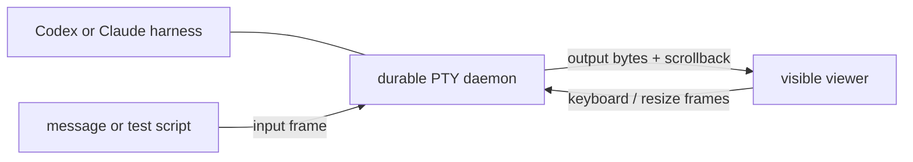

# Architecture

Persona WezTerm is the terminal harness component for Persona. It owns the
durable PTY process and the visible WezTerm attachment layer.

The daemon owns the child process and persists after viewer windows are closed.
Viewers are detachable clients: closing a viewer must not kill the harness.

The protocol between viewer/sender and daemon is intentionally small:

- `Input` frames carry raw bytes into the harness PTY.
- `Resize` frames resize the harness PTY.
- daemon scrollback is replayed to newly attached viewers.

Viewer presentation has two modes. `scrollback` mode leaves WezTerm's terminal
scrollback available for long harness transcripts. `application` mode enters the
alternate screen and enables mouse capture when the harness itself should own
the whole terminal surface.

Persona Message depends on this repo for terminal delivery and visible harness
tests. Persona WezTerm does not depend on Persona Message.
