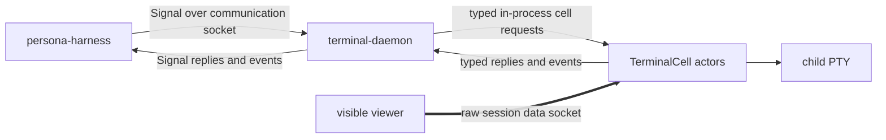

# terminal — architecture

*Persona-facing terminal session owner. One component daemon, one
communication socket, one supervision socket, many internal terminal cells.*

`terminal` owns the Persona-facing surface around named terminal
sessions: typed Signal communication, component Sema registry, session
metadata, viewer-adapter launch policy, and the internal terminal-cell actors
that own child PTYs. The component boundary exposes a **communication socket**
for `signal-terminal` traffic and a **supervision socket** for engine
lifecycle/readiness. Those two sockets are distinct; "control" is not used as
the component-boundary contrast with supervision.

`terminal-cell` is the low-level cell library: one child process group, one
PTY, raw input ports, transcript replay, worker lifecycle observation, and one
active viewer attachment. Production Persona consumes it as a library inside
`terminal-daemon`. The standalone `terminal-cell-daemon` remains a
development/test harness and local primitive, not the production Persona
runtime boundary.

Terminal-brand mux helpers are retired. Viewer and compositor behavior lives
behind this same `terminal` owner and must not become a repository
boundary.

---

## 0 · TL;DR

This repo carries the Persona terminal communication plane. It does not
understand Persona message semantics, routing policy, provider quota policy,
slash-command meaning, or authorization, and it does not move raw viewer
bytes.



The component communication path (`persona-harness` → `terminal`) is
typed Signal. Inside the component daemon, terminal sessions are data-bearing
actors around `terminal-cell`. The data path (visible viewer ↔ session data
socket ↔ terminal cell) is raw bytes.

## 1 · Component Surface

`terminal` exposes:

- consolidated component daemon;
- component communication socket;
- owner-only terminal communication surface;
- component supervision socket;
- checked-in generated triad modules under `src/schema/`, produced from
  `schema/signal.schema`, `schema/nexus.schema`, and `schema/sema.schema` by
  `schema-rust-next`. This substrate exposes the future Signal/Nexus/SEMA nouns
  and generated two-listener daemon spine; live behavior still runs through the
  transitional supervisor until the adapter cutover;
- internal terminal-cell session actors;
- visible viewer client;
- raw input sender client;
- signal terminal request client;
- output scrollback replay;
- resize propagation;
- terminal-cell library adapter;
- terminal Signal control actor for prompt patterns, input-gate leases,
  prompt-state checks, and injection decisions;
- component Sema table for named terminal sessions;
- read-only session inspection CLIs;
- `signal-terminal` request/event adapter.
- `owner-signal-terminal` session-lifecycle adapter.

## 1.5 · Supervision relation, prompt-pattern lifecycle, gate forwarding, message landing

**Communication / raw split.** `terminal` receives ordinary
terminal Signal frames (`ResolveSession`, `RegisterPromptPattern`,
`AcquireInputGate`, `WriteInjection`, `ReleaseInputGate`, subscription
frames, `TerminalCapture`, and the rest of `signal-terminal`) on its
component communication socket. Owner-only session lifecycle frames
(`CreateSession`, `RetireSession`) use `owner-signal-terminal`
and are accepted only on the owner terminal surface. Raw attached-viewer
bytes flow viewer ↔ terminal-cell data path and do not cross either
communication surface.

**Supervision relation.** The engine-facing binary is
`terminal-daemon`. It owns `signal-persona::SpawnEnvelope` handling
and the `signal-persona::SupervisionRequest` answer surface. The daemon reads
its typed configuration at startup, binds its communication and supervision
sockets, starts its terminal session actors, and reports readiness only after
those sockets and actors are available.

**Prompt-pattern lifecycle**. `persona-harness` registers a per-adapter
`PromptPattern` with the supervisor at session-create time via
`signal-terminal::RegisterPromptPattern`. The supervisor
forwards the registration to the relevant terminal-cell `control.sock`; the cell
returns a typed `PromptPatternIdentifier` which the supervisor stores keyed by
harness identity. Later `AcquireInputGate { pattern_id }` requests reference
that id.

**Gate-and-acquire execution.** When the daemon receives `AcquireInputGate`,
it resolves the named session in component Sema, asks that session's terminal
cell to acquire the gate, awaits the typed `GateAcquired { lease,
prompt_state }` reply, and relays it. The `prompt_state` carries `Clean |
Dirty | NotChecked` per `signal-terminal::PromptState`. Prototype
default: dirty state defers injection (`InjectionRejected { reason:
DirtyPrompt }`); clean-then-inject machinery is deferred.

**Message-landing endpoint.** The prototype's live message path terminates
here. `persona-harness` calls `AcquireInputGate { pattern_id }` on
`terminal` → the session actor returns `GateAcquired { lease,
prompt_state }` → if `Clean`, harness calls `WriteInjection { lease, bytes,
injection_sequence }` → the terminal cell writes bytes to the child PTY →
returns `InjectionAck { sequence }` → terminal relays back through harness →
router commits delivery. The bytes appear in the cell transcript; the
prototype's witness reads the transcript to verify the end-to-end path.

## 2 · State and Ownership

The terminal cell owns the child process and PTY. Viewers are disposable
clients. Closing a viewer does not kill the harness.

The production `terminal` supervisor owns the registry around terminal
cells: named sessions, session health, socket paths, viewer attachments, and
Sema-backed durable terminal metadata. The low-level `terminal-cell` session
owns one child process group and one PTY. The supervisor chooses and launches
viewer adapters; the adapters draw windows and forward raw terminal bytes over
the cell's `data.sock`.

The current daemon writes a named session record into the component Sema after
the terminal-cell sockets are bound. The `terminal-sessions` and
`terminal-resolve` binaries are read-only inspection clients for that
Sema state; effect-bearing input, capture, attach, and resize clients still
talk to the terminal socket.

`terminal-signal` is the current contract witness client. It constructs
`signal-terminal` requests, sends them as length-prefixed Signal frames
to a terminal communication socket, and renders the resulting terminal event.

The target runtime ships one component daemon:

`terminal-daemon` is the **component daemon**. It binds the component
communication socket and supervision socket, owns component Sema, starts
data-bearing terminal session actors, and embeds the `terminal_cell` library
for each child PTY. `owner-signal-terminal::CreateSession` mutates
the component registry and starts a terminal session actor.
`signal-terminal::ListSessions` and
`signal-terminal::ResolveSession` read the component registry and
return the data-socket attachment path.
`owner-signal-terminal::RetireSession` removes a session through the
same component owner.

The current implementation still contains transitional binaries whose behavior
is being folded into that daemon:

- `terminal-daemon` currently owns one PTY and writes a
  `SessionRegistration` into component Sema for tests.
- `terminal-supervisor` currently binds the engine-facing Signal
  socket, answers supervision traffic, resolves sessions from component Sema,
  and forwards requests to registered cells.

Those transitional binaries are implementation stepping stones. The durable
architecture is one component daemon with internal session actors.

The Sema session record stores both cell paths as typed fields:
`control_socket_path` for the cell's local Signal/byte-tag control endpoint
and `data_socket_path` for attached viewer byte transport. Component clients
use the component communication socket; viewer adapters attach to session data
sockets. A single socket that changes role by mode, message kind, or
connection phase is not a valid shape.

`TerminalSignalControl` is the first Kameo actor in this repo's supervisor
direction. It owns prompt-pattern registry state, signal input-gate leases,
prompt cleanliness checks, and the decision to accept or reject programmatic
injection. The surrounding daemon still owns the socket accept loop and
terminal-cell session shell; future supervisor work should continue splitting
those runtime planes into named actors instead of growing helper methods.

## 3 · Boundaries

This repo owns:

- terminal session registry policy;
- PTY lifecycle;
- viewer attachment;
- raw input and resize frames;
- output scrollback replay;
- terminal transport request/event adaptation.

This repo does not own:

- Persona messages (`persona-message`);
- routing decisions (`persona-router`);
- harness domain identity (`persona-harness`);
- harness provider-usage interpretation (`persona-harness`);
- OS focus policy (`persona-system`);
- authorization.

`persona-harness` is a sibling engine component and a client of this repo's
terminal contract. `terminal` is not a subcomponent of harness; the
engine manager supervises both and pushes their peer socket paths at spawn.

Production registry state lives in `terminal`'s component Sema, not in
viewer-specific files and not in `terminal-cell`. Runtime-directory metadata
remains a convenience cache; the typed terminal registry is the durable source
of truth. The table value record shapes for inspectable terminal state are
owned by `signal-terminal`'s introspection module; this component owns
the redb file, table declarations, write sequencing, and read consistency.

## 4 · Constraints

Each line is an obligation; each load-bearing constraint has a witness in §5.

### 4.1 · Lifecycle and ownership

- The terminal session owner owns one child process group and its PTY for the
  lifetime of the session.
- Viewer attach, detach, close, crash, or replacement never owns or kills the
  child process.
- Terminal transcript is append-only truth. Every output byte read from the
  PTY master receives a terminal generation and sequence before any viewer
  replay, screen projection, or capture result.

### 4.2 · Communication plane vs data plane

- `terminal` owns the component communication plane. Ordinary typed
  Signal frames flow over the component communication socket.
- Owner-only session lifecycle frames flow over the owner terminal surface.
  The ordinary `signal-terminal` surface does not know
  `CreateSession` or `RetireSession`.
- Raw attached-viewer bytes flow viewer ↔ session data socket ↔ terminal
  cell and never traverse the component communication socket.
- The terminal registry records the terminal-cell control and data socket
  paths as separate typed fields while the current transitional runtime still
  forwards to standalone cells. Component clients do not dial those cell paths
  directly.
- Viewer adapters never connect to the component communication socket. Signal clients
  never carry live attached-viewer bytes.
- The component daemon binds its communication and supervision listeners.
  Session actors expose data attachment paths for viewers.
- There is no single-socket mode-shift path between terminal-cell control
  and data roles.
- Slow transcript work in `terminal-cell` does not back-pressure into the
  attached viewer's data plane.

### 4.3 · Component daemon and transitional binaries

- `terminal-daemon` is the production component daemon. It binds a
  communication socket and a supervision socket, owns component Sema, and
  owns all terminal session actors.
- `terminal-supervisor` is transitional code being folded into the
  component daemon. Its tests remain useful because they prove registry
  resolution, Signal frame handling, and supervision replies.
- Standalone `terminal-daemon` one-PTY behavior is transitional code
  used by stateful witnesses while the consolidated daemon lands.
- Every bound socket applies `PERSONA_SOCKET_MODE` (mode 0600 by default) in
  the engine-spawned path.
- The supervisor binary accepts explicit `--socket` / `--store` overrides
  for tests; the engine path reads `PERSONA_SOCKET_PATH` and
  `PERSONA_STATE_PATH` from the Persona spawn envelope, not ambient
  environment.

### 4.4 · Reattach and viewer

- Reattach is sequence-based. A viewer reconnects from a known terminal
  sequence, receives replayed transcript bytes, then receives live deltas
  from the same stream.
- Screen state and scrollback views are derived projections. They may use
  `vt100`, `termwiz`, or viewer-native state, but they are never the source
  of truth.

### 4.5 · Wire and registry

- Named terminal sessions are component state. The daemon records them in
  `terminal`'s component Sema; no registry JSON, text manifest, or
  viewer-specific state file is the source of truth.
- Session lifecycle mutation is accepted only through
  `owner-signal-terminal`; ordinary terminal Signal can only read
  the registry with `ListSessions` and `ResolveSession`.
- The supervisor socket resolves terminal names through component Sema
  before terminal effects. Callers send `signal-terminal` frames to
  `terminal`, not directly to stored terminal-cell sockets.
- Supervisor-request state is committed around the terminal effect:
  `delivery_attempts` before forwarding, `terminal_events` after the typed
  event returns. Viewer attachments, session health, and session archive
  records are first-class component Sema tables.
- Session registration records both the named terminal session (with typed
  control and data socket paths) and the ready-state session-health row in
  component Sema.

### 4.6 · Subscriptions

- Subscription requests are streams, not one-shot lookups. The supervisor
  resolves the named terminal once, forwards the typed subscription frame
  to the registered terminal control socket, relays the initial state and
  each live delta, and records every typed event it observes.
- Subscription close is a typed retract/close request on the control plane.
  The supervisor forwards the retract; the server emits a final
  acknowledgement event; the stream ends. Raw socket close is not semantic
  protocol.

### 4.7 · Input

- Terminal input is raw byte transport. `TerminalInputBytes` reach the PTY
  without Persona-message parsing, shell parsing, slash-command parsing, or
  provider quota semantics in the terminal owner.
- Programmatic input and viewer keyboard input enter through the same
  terminal input port and produce the same accepted/rejected terminal event
  shape.
- Programmatic injection and human keypresses are serialized through one
  PTY writer per cell; the input gate is the writer-side arbitrator.
- Harness slash-command usage probes are harness-adapter behavior. The
  terminal owner may carry bytes such as `/usage\r`, but quota
  interpretation belongs in `persona-harness` or a harness contract.

### 4.8 · Push and scope

- The terminal owner pushes readiness, transcript, resize, detach, capture,
  exit, and rejection events. Polling is not the steady-state observation
  mechanism.
- The terminal owner provides no pane, tab, status-bar, copy-mode,
  prefix-key, or application-level input grammar. Out-of-band control uses
  typed socket or Signal requests; attached keyboard bytes pass to the PTY
  as terminal input.

## 5 · Witnesses

### 5.1 · Lifecycle and viewer

- **Durable owner**: spawn a child that writes after the viewer exits;
  reattach and prove the child is still alive and the detached output is
  replayed.
- **Sequence replay**: attach at sequence N, detach, emit output, reconnect
  from N, and assert replay starts at N+1 before live deltas.

### 5.2 · Communication plane vs data plane

- **Two-socket registration**: starting `terminal-daemon` with
  `--name` writes a `SessionRegistration` whose typed
  `control_socket_path` and `data_socket_path` fields point at the daemon's
  bound listeners. Reading the row back through the registry returns both.
- **Transitional supervisor uses the cell control socket**: the supervisor
  resolves a named terminal, reads `control_socket_path` from the Sema session
  row, and forwards Signal frames only to that socket. The data socket is not
  opened by the supervisor. In the consolidated daemon this witness becomes
  "the communication socket resolves a session actor and never opens the
  viewer data path."
- **Plane rejection (terminal-cell)**: the underlying terminal-cell daemon
  rejects an `Attach` request on `control.sock` and rejects every
  non-`Attach` request on `data.sock`; the supervisor's typed errors
  reflect these rejections.

### 5.3 · Input

- **Raw pass-through**: send bytes containing escape sequences,
  bracketed-paste markers, and `/usage\r` to a fixture process; assert the
  transcript shows the exact byte path and the terminal crate contains no
  quota or slash parser.
- **Shared input port**: send equivalent bytes through viewer keyboard
  frames and programmatic `TerminalInput`; assert both produce the same
  terminal event path.
- **Harness-owned quota**: a fake harness adapter maps a usage probe to
  raw terminal input and parses a fixture transcript into a harness
  observation; terminal transport contains only byte transport.

### 5.4 · Registry and Sema

- **Component Sema registry**: register a named terminal session, read it
  back with the session inspection CLI, and prove both socket paths came
  from the Sema table. The same witness sets `PERSONA_SOCKET_MODE=600`
  before launching `terminal-daemon` and verifies the
  terminal-cell socket metadata. Exposed as
  `nix run .#test-named-session-registry`.
- **Session-health registration**: register a named terminal session
  through `SessionRegistration`, then read `session_health` and prove a
  ready row with generation 1 exists. Exposed as
  `nix flake check .#terminal-registration-writes-session-health`.
- **T6 table coverage**: write and read `delivery_attempts`,
  `terminal_events`, `viewer_attachments`, `session_health`, and
  `session_archive` through `TerminalTables`; the default flake check
  runs this witness.

### 5.5 · Signal control flow

- **Signal-to-terminal-cell**: start a real terminal-cell-backed daemon,
  resolve its named local control socket from Sema, send `TerminalConnection`,
  `TerminalInput`, and `TerminalCapture` through the
  `signal-terminal` adapter, and prove captured bytes came from
  the child PTY. Exposed as `nix run .#test-terminal-signal`.
- **Gate-and-cache injection**: register a prompt pattern, acquire an
  input gate with clean prompt state, send viewer bytes while locked,
  prove those bytes do not reach the PTY before release, inject under
  the lease, release the gate, and prove cached human bytes replay
  afterward. Exposed as `nix run .#test-gate-cache`.
- **Dirty prompt defers injection**: type a human draft before acquiring
  the gate, acquire with a prompt pattern, observe `PromptState::Dirty`,
  attempt injection, and prove the bytes are rejected instead of
  reaching the PTY. Exposed as `nix run .#test-dirty-prompt-defers`.
- **Actor-owned signal control**: the pure test suite asserts
  `TerminalSignalControl` is a Kameo actor with typed messages and that
  production terminal-control state does not use shared
  `Arc<Mutex<_>>` state.

### 5.6 · Supervisor routing

- **Communication socket routing**: send one `signal-terminal`
  request to the transitional supervisor socket, prove it resolves the named session
  through component Sema, forwards the frame to the registered terminal
  control socket, records the delivery attempt and terminal event, and
  returns the typed terminal event. Exposed as
  `nix flake check .#terminal-supervisor-socket-routes-through-component-sema`.
- **Owner surface separation**: send an
  `owner-signal-terminal::CreateSession` through the
  supervisor's owner request path and prove it reaches the owner surface as
  an owner request, not an ordinary `signal-terminal` variant.
- **Supervisor subscription routing**: send
  `SubscribeTerminalWorkerLifecycle` to the supervisor socket, prove it
  records the attempt, relays an initial lifecycle snapshot and a
  following lifecycle delta from the registered terminal control socket,
  and persists both typed events.
- **Spawn-envelope startup**: construct `terminal-supervisor`
  without CLI path arguments and prove it resolves its socket and
  component Sema path from `PERSONA_SOCKET_PATH` and
  `PERSONA_STATE_PATH`.
- **Supervisor socket mode**: bind `terminal-supervisor` with an
  explicit managed socket mode and prove the real Unix socket metadata
  is mode 0600 on the primary supervisor socket.
- **Supervisor binary applies mode**: the spawned
  `terminal-supervisor` binary applies `PERSONA_SOCKET_MODE` to
  both its supervision socket and its primary supervisor socket.

## 6 · Invariants

- Harness processes are durable across viewer close.
- Viewer adapter mode is explicit. The byte path stays in `terminal-cell`; any
  viewer or compositor behavior stays adapter-local.
- This repo transports bytes without interpreting message semantics.
- Reusable stateful workflows are scripts or Nix apps.

## Code Map

```text
src/pty.rs                         terminal-cell daemon/view/client adapter
src/contract.rs                    signal-terminal adapter
src/signal_control.rs              Kameo actor for prompt/gate/injection control state
src/supervisor.rs                  engine-facing Signal supervisor socket and owner-terminal request surface
src/tables.rs                      component Sema tables over signal-terminal introspection records
src/registry.rs                    session registration + inspection clients
src/capture_validator.rs           structured validator for signal-capture TSV artifacts
src/bin/terminal-daemon.rs  current one-PTY daemon entry; consolidating into component daemon
src/bin/terminal-view.rs    viewer entry
src/bin/terminal-send.rs    raw input sender
src/bin/terminal-sessions.rs read-only session inspection
src/bin/terminal-resolve.rs  read-only session name resolver
src/bin/terminal-signal.rs   signal terminal request client
src/bin/terminal-validate-capture.rs test/debug capture artifact validator
src/bin/terminal-supervisor.rs transitional communication/supervision socket entry
scripts/named-session-registry-witness stateful named-session witness
scripts/terminal-signal-witness      stateful signal-to-terminal-cell witness
scripts/gate-cache-witness           stateful gate-and-cache injection witness
scripts/dirty-prompt-defers-witness  stateful dirty-prompt rejection witness
```

## See Also

- `../persona-harness/ARCHITECTURE.md`
- `../persona-message/ARCHITECTURE.md`
- `../persona-router/ARCHITECTURE.md`
