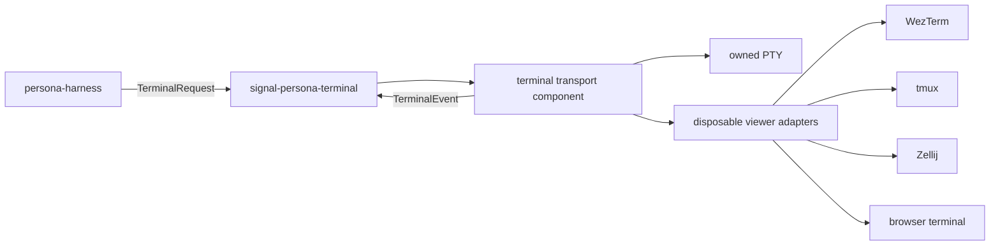

# 1 - Terminal Backend Survey

*Persona terminal transport backend comparison, written 2026-05-10.*

Status as of 2026-05-11: the repo has been renamed to `persona-terminal`.
WezTerm-specific code is shelved adapter material only. `terminal-cell` is the
active low-level PTY/transcript primitive under the Persona-facing terminal
owner.

## Summary

`persona-terminal` exists and works as the current terminal transport
component. It is a Rust crate that owns a durable terminal-cell daemon,
detachable viewer, raw input sender, raw typer, scrollback capture, and shelved
WezTerm mux helper code.

The current implementation can communicate with agent harnesses through
terminal input today:

- `persona-terminal-daemon` starts a child process behind a durable PTY and
  listens on a Unix socket.
- `persona-terminal-view` attaches a disposable terminal viewer to that socket.
- `persona-terminal-send` writes a prompt plus Enter.
- `persona-terminal-type` writes raw text without Enter.
- `persona-terminal-capture` replays scrollback or visible screen text.
- `WezTermMux` uses `wezterm cli --prefer-mux send-text` against an existing
  WezTerm pane.

That is enough for experiments. It is not yet the clean Persona terminal
boundary. The durable shape is:

`persona-harness` should talk to a typed terminal contract, not to a concrete
viewer. `persona-router` should not import terminal transport. The current
direct router to `persona-terminal` dependency is a transitional violation of
the intended direction.

## Current Local State

Repository: `/git/github.com/LiGoldragon/persona-terminal`

Current parent commit:

`bfd2c0f5` - `wezterm: align kameo delivery name`

Current implementation surfaces:

| Surface | File | State |
|---|---|---|
| Durable PTY daemon | `src/pty.rs` | Spawns child processes through `portable-pty`, stores scrollback, broadcasts output, accepts input and resize frames over a Unix socket. |
| Viewer | `src/pty.rs` | Uses `crossterm` raw mode and main/alternate screen presentation modes. |
| Capture | `src/pty.rs` | Uses `vt100` to project raw bytes into visible screen text. |
| WezTerm mux helper | `src/terminal.rs` | Calls `wezterm cli --prefer-mux send-text --pane-id ...`. |
| Kameo delivery actor | `src/terminal.rs` | Removed on 2026-05-11. The WezTerm helper is adapter code, not a blocking actor. |

Current binaries:

| Binary | Purpose |
|---|---|
| `persona-terminal-daemon` | Start a durable PTY session. |
| `persona-terminal-view` | Attach a local terminal viewer to the PTY session. |
| `persona-terminal-send` | Send a full prompt and Enter. |
| `persona-terminal-type` | Type raw text without Enter. |
| `persona-terminal-capture` | Capture raw scrollback or visible screen text. |

Current gaps:

- `signal-persona-terminal` is still missing locally.
- `persona-router` still imports `persona-terminal` directly.
- Terminal events are private byte frames, not typed pushed
  `TerminalReady`, `TranscriptDelta`, `TerminalResized`, and
  `TerminalExited` events.
- `WezTermMux::deliver` uses a fixed sleep between text and Enter. That is
  acceptable only as a temporary edge adapter, not as Persona's terminal
  synchronization primitive.
- Viewer resize forwarding uses a local interval. The final terminal event
  path should be pushed by the producing side.

## Existing Workspace Reports

The backend question is partly covered by older and adjacent reports:

| Report | What remains useful |
|---|---|
| `reports/designer/4-persona-messaging-design.md` | Rejects tmux as Persona truth and favors direct PTY ownership plus a terminal model. Older naming, still useful for the core lesson. |
| `reports/1-gas-city-fiasco.md` | Records why tmux-shaped runtime state failed as a source of truth. |
| `reports/designer/12-no-polling-delivery-design.md` | Establishes pushed observations and terminal parser concerns. |
| `reports/operator/67-signal-actor-messaging-gap-audit.md` | Names the router to terminal coupling gap. |
| `reports/designer/97-persona-system-vision-and-architecture-development.md` | Strongest current design for `signal-persona-terminal` between `persona-harness` and `persona-terminal`. |
| `reports/system-specialist/99-chroma-wezterm-freeze-incident.md` | Operational warning against global live WezTerm mutation. |
| `reports/system-specialist/100-wezterm-live-palette-research.md` | Shows WezTerm public CLI lacks a safe per-window palette acknowledgement. |
| `reports/system-specialist/101-chroma-wezterm-crash-suspects.md` | Points at a Niri/libwayland/WezTerm failure mode and recommends keeping WezTerm out of critical active sessions until isolated. |

There was no current repo-local backend comparison before this report.

## WezTerm Upstream State

Name: WezTerm. The workspace has no meaningful `WesTerm` references.

Canonical repository: <https://github.com/wezterm/wezterm>

Official site: <https://wezterm.org/>

Implementation language: Rust. GitHub reports the repo as 98.9% Rust. The
official description is a cross-platform terminal emulator and multiplexer
implemented in Rust.

GitHub API snapshot on 2026-05-10:

| Metric | Value |
|---|---|
| Stars | 26,028 |
| Forks | 1,423 |
| Open issues plus pull requests | 1,714 |
| Primary language | Rust |
| Last pushed | 2026-05-01 |
| Latest GitHub release | `20240203-110809-5046fc22`, published 2024-02-03 |

Local source clone:

`/git/github.com/wezterm/wezterm`

Checked-out commit:

`577474d89ee61aef4a48145cdec82a638d874751`

Commit date:

`2026-03-31T04:00:28-07:00`

The project is active in source, but its formal stable release cadence is
slow. That matters for Persona because bugs in Wayland, multiplexing, color
state, or pane control may require nightlies or source builds rather than a
fresh stable release.

WezTerm's own CLI documentation says `wezterm cli` can interact with a running
GUI or multiplexer instance and manipulate tabs and panes. It also documents
targeting a specific GUI or mux instance with `WEZTERM_UNIX_SOCKET`, and pane
targeting through `--pane-id`. This is useful for a viewer adapter, but it is
not the same as owning the harness PTY or receiving typed render-completion
events.

Community signal is mixed:

- Positive: WezTerm remains a popular terminal with a capable mux, Rust code,
  Lua configuration, and active main-branch work.
- Concern: recent user discussions ask about the long gap since the February
  2024 stable release and the large open issue count.
- Local operational signal: this workspace has seen serious WezTerm/Niri
  incidents under active agent load, enough that WezTerm should not be the only
  critical-session backend until isolated repros are understood.

Conclusion: WezTerm is viable as one adapter and as a visible/detachable
viewer. It should not be Persona's terminal truth.

## Backend Candidates

GitHub metrics below are from the GitHub API on 2026-05-10.

| Candidate | Repo | Stars | Language | Latest release/tag | Persona fit |
|---|---:|---:|---|---|---|
| Raw PTY plus parser | local crate stack | n/a | Rust | n/a | Best core truth. Persona owns the child process, PTY, transcript, and typed events. |
| WezTerm | `wezterm/wezterm` | 26,028 | Rust | 2024-02-03 release | Good viewer and optional mux adapter. Risky as sole critical backend under current Wayland incidents. |
| tmux | `tmux/tmux` | 45,298 | C | `3.6a`, 2025-12-05 | Mature detach/mux substrate, but wrong as Persona truth. Could be a compatibility viewer/control adapter. |
| Zellij | `zellij-org/zellij` | 32,352 | Rust | `v0.44.2`, 2026-05-05 | Strong Rust multiplexer with browser access. Worth a prototype adapter for remote viewing and shared sessions. |
| kitty | `kovidgoyal/kitty` | 32,857 | Python/C/Go | `v0.46.2`, 2026-03-21 | Strong remote-control protocol. Useful adapter candidate if socket control is explicitly enabled and constrained. |
| Ghostty/libghostty | `ghostty-org/ghostty` | 54,154 | Zig | `v1.3.1` tag | Promising terminal engine and native viewer future. `libghostty` API is not yet stable enough to be Persona core. |
| Alacritty | `alacritty/alacritty` | 63,972 | Rust | `v0.17.0`, 2026-04-06 | Excellent simple terminal, weak backend fit because it intentionally omits mux/session control. |

### Raw PTY Plus Parser

This is the current `persona-terminal` core and should remain the first-class
truth:

- `portable-pty` gives Persona direct child-process and PTY ownership.
- `vt100` gives a cheap screen projection for guard checks.
- `termwiz` remains a richer future parser/surface option if `vt100` becomes
  too small.
- A future `libghostty-vt` path may become attractive once its API stabilizes.

The important distinction: Persona should own the PTY and emit typed terminal
events. GUI terminals and multiplexers are viewers or control adapters, not
the database of what happened.

### WezTerm

Strengths:

- Rust codebase, cross-platform terminal, built-in mux, pane and socket CLI.
- Good visible/detachable fit for humans who already work in WezTerm.
- `wezterm cli list` and `send-text` are enough for simple pane delivery.

Risks:

- Stable release is old relative to active main.
- Public CLI does not expose every internal operation we might want.
- `send-text` is child input, not a terminal-render acknowledgement.
- Local incidents show WezTerm can be part of destructive Wayland failure
  chains under agent-heavy load.

Persona stance: keep WezTerm as an adapter, not as terminal truth.

### tmux

Strengths:

- Very mature; detach/reattach is exactly what it was built for.
- Huge existing operations knowledge.
- Scriptable and stable.

Risks:

- tmux becomes its own terminal state machine and control language.
- Screen scraping or tmux-pane truth repeats the Gas City mistake.
- The terminal contract would be shaped around tmux instead of Persona's own
  typed event stream.

Persona stance: optional compatibility adapter only.

### Zellij

Strengths:

- Rust implementation.
- Active releases.
- Built-in web client can make a local terminal emulator optional.
- Good fit for shared human observation or remote viewing.

Risks:

- It is a workspace/multiplexer product, not a small terminal core library.
- A Persona adapter would need to respect Zellij's own session model.
- No current local Persona design has evaluated its control API deeply.

Persona stance: promising second adapter to research after the typed terminal
contract lands.

### kitty

Strengths:

- Popular, active, feature-rich terminal.
- Remote control protocol is JSON-shaped and can target windows/tabs.
- Programmatic control is more explicit than many terminal emulators.

Risks:

- Remote control must be enabled deliberately and is a security boundary.
- The protocol is kitty-specific.
- It remains a GUI terminal adapter, not Persona's PTY truth.

Persona stance: strong adapter candidate if constrained to a local socket and
tested under agent load.

### Ghostty And libghostty

Strengths:

- Fast-growing, high-attention terminal project.
- Zig core, native GUI, and embeddable `libghostty`.
- `libghostty-vt` is directionally close to what Persona wants for a reusable
  terminal model.

Risks:

- `libghostty` is not yet a stable standalone API.
- Using it from Rust adds FFI and build-system cost.
- Ghostty itself is a terminal emulator, not a harness transport protocol.

Persona stance: watch closely. It may become the best parser/viewer substrate,
but it should not block the raw PTY plus typed-event design.

### Alacritty

Strengths:

- Large user base, Rust, simple, active.
- Good human terminal.

Risks:

- Intentionally minimal: no tabs, splits, mux, or remote control surface that
  fits Persona harness management.

Persona stance: not a useful backend beyond "open a viewer process."

## Recommended Persona Direction

1. Keep `persona-terminal` as the current terminal transport repo while the
   implementation is small.

2. Treat the durable PTY plus typed transcript/event stream as the core
   backend. Do not make WezTerm, tmux, Zellij, kitty, or Ghostty the source of
   truth.

3. Add `signal-persona-terminal` before broadening backend support. The
   contract should carry typed request/event records between `persona-harness`
   and terminal transport:

   - `TerminalConnection`
   - `TerminalInput`
   - `TerminalResize`
   - `TerminalDetachment`
   - `TerminalReady`
   - `TranscriptDelta`
   - `TerminalExited`
   - `TerminalRejected`

4. Move terminal delivery out of `persona-router`. Router chooses when a
   delivery should happen; harness owns the terminal session for that harness;
   terminal transport owns bytes and viewers.

5. Keep viewer backends disposable:

   - `WezTermViewer`
   - `TmuxViewer`
   - `ZellijViewer`
   - `KittyViewer`
   - `BrowserViewer`

   Viewer close must never kill the harness child process.

6. If more than one backend becomes real, keep them as adapters inside
   `persona-terminal` unless a future report establishes a stronger boundary.
   Do not create terminal-brand owner repositories.

## Source Links

- WezTerm official site: <https://wezterm.org/>
- WezTerm GitHub: <https://github.com/wezterm/wezterm>
- WezTerm CLI documentation: <https://wezterm.org/cli/cli/index.html>
- WezTerm multiplexing documentation: <https://wezterm.org/multiplexing.html>
- WezTerm releases: <https://github.com/wezterm/wezterm/releases>
- tmux GitHub: <https://github.com/tmux/tmux>
- tmux getting started: <https://github.com/tmux/tmux/wiki/Getting-Started>
- Zellij GitHub: <https://github.com/zellij-org/zellij>
- Zellij web client: <https://zellij.dev/documentation/web-client.html>
- kitty GitHub: <https://github.com/kovidgoyal/kitty>
- kitty remote control protocol: <https://sw.kovidgoyal.net/kitty/rc_protocol/>
- Ghostty GitHub: <https://github.com/ghostty-org/ghostty>
- Ghostty about/libghostty: <https://ghostty.org/docs/about>
- Alacritty GitHub: <https://github.com/alacritty/alacritty>
- `portable-pty` docs: <https://docs.rs/portable-pty/latest/portable_pty/>
- `vt100` docs: <https://docs.rs/vt100/latest/vt100/>
- `termwiz` docs: <https://docs.rs/termwiz>
