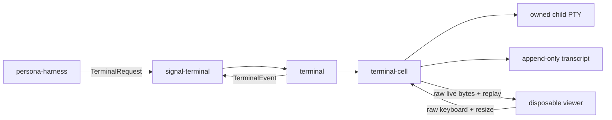

# 1 - Terminal Backend Stance

*Current Persona terminal transport stance, revised 2026-05-11.*

## Summary

`terminal` is the Persona-facing terminal owner. It wraps
`terminal-cell`, which owns the low-level PTY, transcript, attach, resize,
input, capture, and child-process lifecycle mechanics.

The terminal stack is not a terminal-emulator integration project. Brand mux
helpers are retired. Viewer processes are disposable clients around the durable
PTY owner; they are not the source of truth and they do not define repository
boundaries.

## Current Local State

Repository: `/git/github.com/LiGoldragon/terminal`

Current implementation surfaces:

| Surface | File | State |
|---|---|---|
| Durable PTY daemon | `src/pty.rs` | Starts child processes through `terminal-cell`, stores scrollback, accepts input and resize frames over a Unix socket. |
| Viewer | `src/pty.rs` | Uses `crossterm` raw mode and main/alternate screen presentation modes. |
| Capture | `src/pty.rs` | Uses `vt100` to project raw bytes into visible screen text. |
| Contract adapter | `src/contract.rs` | Binds local terminal transport values to `signal-terminal`. |

Current binaries:

| Binary | Purpose |
|---|---|
| `terminal-daemon` | Start a durable PTY session. |
| `terminal-view` | Attach a local terminal viewer to the PTY session. |
| `terminal-send` | Send a full prompt and Enter. |
| `terminal-type` | Type raw text without Enter. |
| `terminal-capture` | Capture raw scrollback or visible screen text. |

## Boundaries

`persona-harness` talks to `signal-terminal`; it does not target a
viewer implementation. `persona-router` chooses delivery policy; it does not
own terminal bytes. `terminal` owns terminal transport, named terminal
sessions, and the component Sema metadata that will make those sessions durable
as Persona state.

The durable backend remains raw PTY plus typed transcript/event stream:

- `terminal-cell` owns the child process, PTY, attach path, and transcript
  record.
- `terminal` owns naming, registry policy, Signal adaptation, and
  viewer-launch policy.
- `signal-terminal` owns the request/event vocabulary between harness
  and terminal transport.

## Constraints

- Viewer close never kills the harness child process.
- Viewer adapters are clients, not state owners.
- Transcript bytes are append-only truth.
- Screen state and scrollback are projections over transcript bytes.
- Programmatic input and attached keyboard input enter through the same PTY
  writer path.
- Terminal transport does not parse Persona messages, slash commands, provider
  quota, or authorization.
- Terminal observations are pushed as typed events; steady-state consumers do
  not poll.

## Recommended Direction

1. Keep `terminal` as the terminal transport owner.
2. Keep `terminal-cell` as the low-level one-cell PTY primitive.
3. Keep `signal-terminal` as the only harness-facing contract.
4. Move router-to-terminal coupling behind typed harness/terminal contracts.
5. Add viewer support only as disposable adapter policy inside
   `terminal`.
6. Do not create terminal-brand owner repositories or resurrect mux-helper
   delivery paths.
